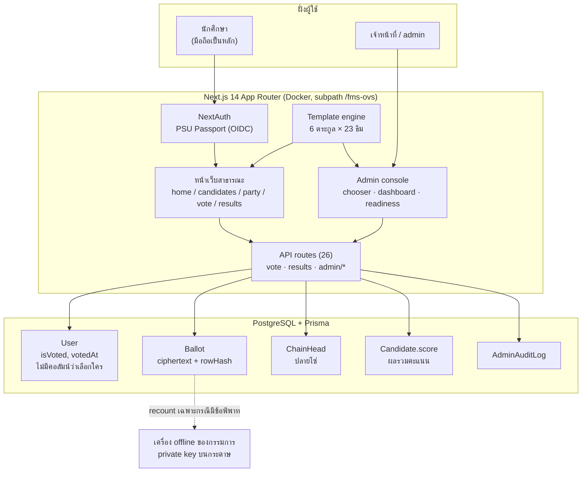

# FMS Online Voting System — ชุดข้อมูลสำหรับ Portfolio

> วัตถุดิบทั้งหมดที่ควรใส่ใน portfolio ของโปรเจกต์นี้ ตัวเลขทุกตัวดึงจาก repo จริง ณ 2026-07-27 (HEAD `5ae8f4b`)
> ใช้ได้ทั้งเว็บ portfolio, PDF, Behance/Notion, และตอบสัมภาษณ์

---

## 1. หัวเรื่อง (เลือกใช้ตามพื้นที่)

**ชื่อโปรเจกต์:** FMS Online Voting System (FMS-OVS)

**หนึ่งบรรทัด:**
> ระบบเลือกตั้งออนไลน์ของสโมสรนักศึกษา คณะวิทยาการจัดการ ม.อ. ที่ออกแบบให้ผลคะแนนพิสูจน์ได้ว่าไม่ถูกแก้ และไม่มีใครสืบได้ว่าใครเลือกพรรคไหน

**หนึ่งย่อหน้า:**
> ระบบลงคะแนนออนไลน์ที่ใช้จริงกับการเลือกตั้งสโมสรนักศึกษา (SAMO 49) นักศึกษาเข้าระบบด้วย PSU Passport โหวตได้คนละหนึ่งครั้ง บัตรทุกใบถูกเข้ารหัสแยกจากตัวตนผู้โหวต และร้อยเป็น hash chain ที่ตรวจย้อนหลังได้ทั้งตาราง งานหลักไม่ใช่แค่ทำให้เว็บโหวตได้ แต่คือทำให้ผลลัพธ์ "เชื่อถือได้" ในเชิงเทคนิค และส่งมอบให้สโมสรรุ่นถัดไปใช้ซ้ำได้ทุกปีโดยไม่ต้องมีโปรแกรมเมอร์

**Tagline สั้นสำหรับการ์ด:** Anonymous, tamper-evident student election — Next.js + PostgreSQL

---

## 2. บริบทและบทบาท

| หัวข้อ | รายละเอียด |
|---|---|
| ประเภท | ระบบใช้งานจริง (production) ขององค์กรนักศึกษา ไม่ใช่โปรเจกต์ฝึกหัด |
| ผู้ใช้ | นักศึกษาคณะวิทยาการจัดการ ม.สงขลานครินทร์ (ชั้นปี 1-4) + เจ้าหน้าที่ผู้ดูแลการเลือกตั้ง |
| บทบาท | Solo developer — ออกแบบระบบ, ฐานข้อมูล, ความปลอดภัย, UI ทั้งหมด, เอกสารส่งมอบ |
| ระยะเวลา | ม.ค. 2026 – ก.ค. 2026 (~7 เดือน) |
| Stack | Next.js 14 (App Router), PostgreSQL + Prisma, NextAuth (PSU SSO / OIDC), Tailwind, Framer Motion, Recharts, Playwright, Docker |

**สิ่งที่ทำเอง:** requirement จากคณะกรรมการเลือกตั้ง, ออกแบบ threat model, schema, crypto scheme ของบัตรลงคะแนน, ระบบ template, ชุดทดสอบ, runbook และเอกสารส่งมอบรุ่นถัดไป

---

## 3. โจทย์ (Problem)

การเลือกตั้งสโมสรเดิมใช้กระดาษ + นับมือ ปัญหาที่ต้องแก้:

1. **ความน่าเชื่อถือ** — ถ้าผลออกมาสูสี ต้องมีวิธีพิสูจน์ว่าคะแนนไม่ถูกแก้ ไม่ใช่แค่ "เชื่อกรรมการ"
2. **ความลับของบัตร** — ระบบออนไลน์ที่ผูก user กับตัวเลือกไว้ใน row เดียว = ใครเข้าถึง DB ได้ก็รู้หมดว่าใครเลือกใคร ซึ่งผิดหลักการเลือกตั้งลับ
3. **โหวตซ้ำ** — ต้องกันได้จริงแม้ผู้ใช้กดพร้อมกันหลายครั้ง/หลายแท็บ
4. **ส่งต่อทุกปี** — ทีมสโมสรเปลี่ยนทุกปี และไม่มีใครเป็นโปรแกรมเมอร์ ระบบต้องเปลี่ยนปี เปลี่ยนรายชื่อ เปลี่ยนหน้าตาเว็บได้โดยไม่แตะโค้ด
5. **หน้าตา** — เว็บราชการแบบเดิมทำให้นักศึกษาไม่อยากเข้า ต้องดูร่วมสมัยและใช้บนมือถือได้จริง

---

## 4. ตัวเลขของโปรเจกต์ (ใส่เป็น stat strip ได้)

| ตัวเลข | ความหมาย |
|---|---|
| **587 commits** | ตลอด 7 เดือน (ผู้พัฒนาคนเดียว) |
| **~62,400 บรรทัด** | ใน `src/` — 283 ไฟล์ (241 `.js`, 42 `.jsx`) |
| **26 API routes** · **15 หน้า** | Next.js App Router |
| **8 Prisma models** · **8 migrations** | User, Member, Candidate, Ballot, ChainHead, AdminAuditLog, SystemConfig, Template |
| **6 ตระกูล template · 23 ธีม** | สลับหน้าตาเว็บทั้งระบบจาก admin คลิกเดียว |
| **15 smoke + 35 e2e** | Node test runner + Playwright (โหวตครบวงจร, โหวตแข่งกัน, embargo, สิทธิ์ admin) |
| **14 รายการตรวจความพร้อม** | ปุ่มเดียวในหน้า admin ตรวจก่อนเปิดหีบ |
| **125 บทเรียนที่บันทึกไว้** | `DECISIONS.md` — pitfall log ที่โตขึ้นทุก session |
| **2,000 mock voters** | ชุด seed สำหรับทดสอบภาระจริง |

---

## 5. สถาปัตยกรรมระบบ



**หลักการที่ยึด:**
- ตัวเลือกของผู้โหวตไม่มีอยู่ในรูปที่อ่านได้ ณ ที่ใดในระบบ — มีแค่ ciphertext ในตาราง `Ballot`
- ตาราง `User` รู้แค่ว่า "โหวตแล้ว" กับ "เมื่อไหร่" ไม่มี FK ไปยังพรรคเลย (คอลัมน์ `User.candidateId` ถูกลบทิ้งตั้งใจ)
- `Ballot` ไม่มี userId และเก็บเวลาแค่ระดับ "ชั่วโมง" เพื่อไม่ให้เอา timestamp มา join กลับหาคนโหวตได้

---

## 6. ไฮไลต์ที่ 1 — บัตรลงคะแนนนิรนามที่ตรวจการแก้ไขได้ (จุดขายหลัก)

ออกแบบเองทั้งชุด ใช้ `node:crypto` ล้วน ไม่เพิ่ม dependency

**สามชั้นที่ทำงานร่วมกัน**

1. **แยกตัวตนออกจากตัวเลือก** — ตอนโหวต ระบบเขียนสองที่คนละตาราง: ตีตรา `isVoted` ที่ผู้ใช้ และหย่อนบัตรที่เข้ารหัสแล้วลงตาราง `Ballot` ไม่มีคีย์เชื่อมสองสิ่งนี้เข้าหากัน
2. **เข้ารหัสบัตร (RSA-OAEP + nonce)** — plaintext คือ `{ c: candidateId, n: nonce 128-bit }` nonce ทำให้บัตรที่เลือกพรรคเดียวกันได้ ciphertext ไม่ซ้ำกัน กัน dictionary attack บนช่วงค่า candidateId ที่มีน้อยมาก
3. **Hash chain (HMAC)** — บัตรทุกใบเก็บ `prevHash` และ `rowHash = HMAC(secret, prevHash‖payload‖seq)` ถ้ามีใครลบ แทรก หรือแก้บัตรกลางตาราง โซ่จะขาดที่จุดนั้นทันที ตรวจได้ด้วย `verify-ballot-chain.js`

**การจัดการกุญแจ (key ceremony)** — สร้างคู่กุญแจปีละครั้งบนเครื่อง offline, พิมพ์ private key ลงกระดาษแบ่งเก็บระหว่างเจ้าหน้าที่กับอาจารย์ที่ปรึกษา, บนเซิร์ฟเวอร์มีแค่ public key แปลว่า **ต่อให้ยึดเซิร์ฟเวอร์ได้ก็ถอดรหัสบัตรไม่ได้** private key ถูกใช้เฉพาะตอนมีข้อพิพาทเพื่อ recount แบบ offline

**Fail closed** — ถ้า env กุญแจไม่ครบ endpoint โหวตตอบ 503 ทันที ไม่มี fallback ไปเก็บตัวเลือกแบบ plaintext เด็ดขาด

**Least privilege ระดับ DB** — production รัน `scripts/sql/ballot-grants.sql` ให้ user ของแอปมีสิทธิ์แค่ `INSERT` บนตารางบัตร ไม่มี UPDATE/DELETE แปลว่าการเลือกตั้งที่จบแล้วแก้ไม่ได้แม้ผ่านโค้ดของแอปเอง

> ประโยคที่ใช้ได้เลยใน portfolio:
> "ออกแบบ ballot scheme ที่แยกตัวตนผู้โหวตออกจากตัวเลือกโดยสิ้นเชิง — เข้ารหัส RSA-OAEP + nonce, ร้อย HMAC hash chain กันการแก้ย้อนหลัง, private key เก็บ offline นอกเซิร์ฟเวอร์ และปิดรับโหวตทันทีถ้ากุญแจไม่พร้อม (fail closed)"

---

## 7. ไฮไลต์ที่ 2 — หนึ่งคนหนึ่งเสียง ภายใต้ race condition

ปัญหาเดิม: เช็ค `isVoted` แล้วค่อยเขียน = TOCTOU race ถ้าผู้ใช้กดสองแท็บพร้อมกัน อาจนับสองครั้ง

วิธีแก้: ธุรกรรมเดียวที่ให้การรับประกันสามอย่างพร้อมกัน

- **compare-and-set** — `updateMany({ where: { isVoted: false }})` ใครได้ `count === 1` คนนั้นได้สิทธิ์ อีกคนได้ 0 แล้วถูกปฏิเสธ ไม่มีทางเขียนซ้ำ
- **serialize โซ่บัตร** — `SELECT ... FOR UPDATE` บนแถว `ChainHead` ทำให้คำขอที่มาพร้อมกันเรียงคิวกัน ทุกใบจึงได้ `prevHash` ที่ถูกต้องจริง โซ่ไม่ขาดแม้โหวตชนกันพอดี
- **นับคะแนนแบบ atomic** — `score: { increment: 1 }`

การเข้ารหัสถูกทำ **ก่อน** เข้าธุรกรรม เพื่อให้ถือ row lock สั้นที่สุด (ciphertext ไม่ขึ้นกับสถานะโซ่)

พิสูจน์ด้วยเทสต์: ยิงสองคำขอพร้อมกันจากผู้ใช้คนเดียวกัน ต้องสำเร็จหนึ่ง ปฏิเสธหนึ่ง และคะแนนรวมต้องเพิ่มหนึ่ง

---

## 8. ไฮไลต์ที่ 3 — ระบบ template 6 ตระกูล 23 ธีม

ตอนแรกเริ่มจากการทำ **web editor แบบ Canva** ให้ admin ลากวางเอง ทำไปได้ไกลพอสมควรแล้ว **ตัดสินใจ retire ทิ้ง** เพราะได้ข้อสรุปว่าสิ่งที่สโมสรต้องการจริงคือ "ความหลากหลาย" ไม่ใช่ "เครื่องมือออกแบบ" และระบบที่ต้องอยู่ไปอีกสิบปีต้องการความทนทาน มากกว่าความยืดหยุ่นที่ไม่มีใครดูแลได้

ผลที่ได้คือ template สำเร็จรูปที่แต่ละตระกูลมี layout ของตัวเองครบทุกหน้า:

| ตระกูล | บุคลิก | จำนวนธีม |
|---|---|---|
| `original` | SAMO คลาสสิก สะอาด ม่วง FMS | 1 (ตั้งใจให้พาเลตต์เดียว) |
| `gumroad` | นีโอบรูทัล สีจัด มีพลัง | 6 |
| `studio-dark` | ดาร์ก editorial + rail ซ้าย + ไลม์ | 4 |
| `verdure` | เซริฟ editorial เขียว + wax seal | 4 |
| `blossom` | อ่อนหวาน โปร่ง | หลายธีม |
| `receipt` | ใบเสร็จ/ม้วนกระดาษ เล่นกับ metaphor การลงคะแนน | 4 |

**สิ่งที่น่าสนใจเชิงวิศวกรรม (พูดในสัมภาษณ์ได้):**
- สถาปัตยกรรมสีเป็น **single source of truth ต่อตระกูล** — เพิ่มธีมใหม่ = แก้ 3 จุด (palette → builder → registry) ที่เหลือไหลตามเอง พิสูจน์แล้ว 3 รอบ
- โทเคนสองชั้น: Layer-1 (`--color-*` ระดับธีม) และ Layer-2 (ตัวแปรระดับ element) โดยมีกติกาบังคับว่า Layer-2 ที่เป็นสีต้อง reference โทเคนเสมอ ห้ามฮาร์ดโค้ด
- **preview ต้องตรงกับของจริงแบบ byte-level** — ตัว injector ที่ใช้พรีวิวกับตัว builder ที่ใช้ render จริงต้อง map ตรงกัน มี invariant คุมไว้ 7 ข้อ
- มีหน้า `/template-preview` และ `/template-playground` ที่ลองได้ทั้ง flow (home → login → vote → success) โดย **ไม่แตะ DB** — ทำให้ตัดสินใจเลือกธีมได้โดยไม่กระทบระบบจริง

---

## 8.5 งาน UX/UI — เกณฑ์ที่ใช้ตัดสินและการตัดสินใจที่เล่าได้

ส่วนนี้คือหลักฐานว่าโปรเจกต์นี้ไม่ได้ "เขียนระบบเป็น" อย่างเดียว แต่ตั้งเกณฑ์ดีไซน์เองและตรวจตัวเองตามเกณฑ์นั้น

### เกณฑ์คุณภาพ 5 ข้อที่ใช้ตรวจทุกหน้า

ไม่เอา gimmick — ตั้งใจให้สวยจาก craft พื้นฐาน 5 เรื่อง และทุกข้อ **ตรวจได้จริง** ไม่ใช่ความรู้สึก

| มิติ | เกณฑ์ที่ต้องผ่าน |
|---|---|
| Typography | scale ไม่เกิน 3 ระดับต่อวิว · line-height 1.1 หัวเรื่อง / 1.6 เนื้อหา · ตัวเลขสถิติใช้ `tabular-nums` เพื่อไม่ให้ตัวเลขเต้นตอนนับ |
| Spacing | จังหวะ 4/8px ตลอด · whitespace ใจกว้าง · ไม่มี element ชนกันหรือชิดขอบโดยไม่ตั้งใจ |
| Colour | contrast เนื้อหา ≥ 4.5:1 หัวเรื่องใหญ่ ≥ 3:1 · ไม่เกิน 3 สีต่อวิว (ธีม + กลาง + accent) |
| Motion | ใช้เมื่อมีความหมายเท่านั้น (feedback / transition) · 150-300ms ease-out · เคารพ `prefers-reduced-motion` |
| Hierarchy | ทุกหน้าต้องตอบได้ใน 1 วินาทีว่า "หน้าอะไร ต้องทำอะไรต่อ" · CTA หลักหนึ่งเดียวเด่นสุด ปุ่มรองห้ามแย่งซีน |

**Mobile-first เป็น gate ไม่ใช่คำพูดสวย** — ทุกหน้ารีวิวที่ 375px ก่อน desktop เสมอ เพราะผู้ใช้จริงเกือบทั้งหมดโหวตจากมือถือระหว่างเดินอยู่ในคณะ · mobile ต้อง "ถูกออกแบบ" ไม่ใช่ desktop ที่ย่อลงมา

**State ต้องครบ** — ทุกหน้าและทุก element สำคัญมี loading / empty / error / disabled ที่เป็นสีของธีมนั้นจริง ไม่ใช่ spinner สีเทาที่หลุดจากธีม

### Design system: token สองชั้น

- **Layer 1** — `--color-*` ระดับธีม มาจาก palette ไฟล์เดียวต่อตระกูล (source of truth)
- **Layer 2** — ตัวแปรระดับ element (`--btn-padding-x`, `--btn-radius`, …) โดยมีกติกาบังคับว่า **ตัวแปรที่เป็นสีต้อง reference token เสมอ ห้ามใส่ hex ตรง ๆ** — กติกาข้อนี้เกิดจากบั๊กจริง: ตอนสลับธีม element ที่ hardcode สีไว้จะค้างสีเดิม ทำให้พรีวิวกับของจริงไม่ตรงกัน
- ผลคือเพิ่มธีมใหม่ = แก้ 3 จุด ที่เหลือไหลตามทั้งระบบ และพรีวิวตรงกับของจริงเสมอ

### การตัดสินใจ UX ที่เล่าในสัมภาษณ์ได้

1. **บัตรพรรคเดียวต้องมี 3 ทางเลือก** — เมื่อมีผู้สมัครพรรคเดียว การให้กดได้แค่ "เลือก" คือการบังคับ ระบบจึงเปลี่ยนบัตรเป็น รับรอง / ไม่รับรอง / งดออกเสียง พร้อมสี semantic คงที่ (เขียว/แดง/ส้ม) ที่ **ไม่เปลี่ยนตามธีม** เพราะความหมายของสีในบริบทนี้สำคัญกว่าความสวยของพาเลตต์
2. **ผลคะแนนที่ยังไม่ถึงเวลา ต้องออกแบบหน้า "ล็อก" ไม่ใช่ซ่อนเมนู** — คนที่กดเข้ามาต้องเข้าใจว่าทำไมยังดูไม่ได้ และดูได้เมื่อไหร่ จึงทำเป็นการ์ด embargo ที่บอกสถานะและเวลาชัดเจน (และคะแนนถูกปิดตั้งแต่ชั้น API ด้วย ไม่ใช่แค่ซ่อนใน UI)
3. **ห้ามซ่อนเนื้อหาสำคัญไว้หลัง animation** — กติกาที่ตั้งขึ้นหลังเจอของจริง: บัตรลงคะแนนเคย `opacity: 0` รอ reveal แล้ว reveal ไม่ทำงานบนบางเครื่อง = บัตรหายทั้งหน้า ตั้งแต่นั้นบัตร/รายชื่อพรรค/ผลคะแนนห้ามพึ่ง JS reveal และมีการตรวจด้วย `getComputedStyle` จริง
4. **ปุ่มรองห้ามแย่งซีน** — บทเรียนจากหน้าผลคะแนนที่ปุ่มรองสีฟ้าเด่นกว่า CTA หลัก คนกดผิดทาง แก้ด้วยการลดน้ำหนักปุ่มรอง ไม่ใช่เพิ่มน้ำหนักปุ่มหลัก
5. **เคารพ reduce-motion แต่ไม่ยอมให้หน้าตาย** — ระบบเคารพ `prefers-reduced-motion` ทุกจุดที่เป็น animation เชิงตกแต่ง แต่ยกเว้น marquee ที่เป็น identity ของธีมนั้นจริง ๆ ตัดสินใจแยกทีละกรณี ไม่เหมาเข่ง
6. **template แต่ละตระกูลมี "พิธีกรรม" ของตัวเอง** — verdure จบด้วยการประทับ wax seal, receipt เป็นม้วนใบเสร็จที่หย่อนลงหีบจริง ๆ, gumroad เป็นนีโอบรูทัลสีจัด · เพราะช่วงเวลาที่กดโหวตเสร็จคือช่วงเวลาที่ควรรู้สึกว่า "เสียงของเราถูกนับแล้ว" ไม่ใช่แค่ alert ว่า success
7. **ให้ admin ลองก่อนเลือก** — หน้า `/template-preview?...&interact=1` เดินได้ทั้ง flow (home → login → vote → success) โดยไม่แตะ DB คนที่ไม่ใช่ dev จึงตัดสินใจเลือกธีมได้จากการ "ลองใช้จริง" ไม่ใช่จากภาพนิ่ง

### สิ่งที่ตัดทิ้ง (เล่าแล้วได้แต้ม)

ระบบเคยมี **editor แบบ Canva** ให้ admin ลากวางเอง ทำไปไกลแล้วตัดสินใจทิ้ง เพราะสิ่งที่ผู้ใช้ต้องการจริงคือ "หน้าตาที่หลากหลายและสวยพร้อมใช้" ไม่ใช่ "เครื่องมือออกแบบ" และเครื่องมือออกแบบที่ไม่มีคนดูแลจะกลายเป็นภาระของรุ่นถัดไป — การตัดฟีเจอร์ที่ตัวเองสร้างมากับมือคือการตัดสินใจเชิงผลิตภัณฑ์ ไม่ใช่เชิงเทคนิค

---

## 9. ไฮไลต์ที่ 4 — ออกแบบเพื่อการส่งมอบ (ข้อที่คนอื่นมักไม่มีใน portfolio)

ระบบนี้ต้องอยู่ต่อโดยไม่มีผู้พัฒนาเดิม จึงออกแบบ "งานประจำปี" ไว้เป็นส่วนหนึ่งของผลิตภัณฑ์:

- **ปุ่มตรวจความพร้อม 14 รายการ** ในหน้า admin — ตรวจ config, กุญแจ, วันเวลา, รายชื่อ, template ให้ครบก่อนเปิดหีบ อ่านอย่างเดียว ไม่เขียนอะไร
- **Audit log** — ทุกคำสั่งของ admin ถูกบันทึก และมีตัวล็อกกันกดรีเซ็ตข้อมูลระหว่างที่การโหวตยังเปิดอยู่
- **Embargo ผลคะแนน** — คะแนนถูกปิดตั้งแต่ชั้น API ไม่ใช่แค่ซ่อนใน UI จนกว่า admin จะสั่งเปิด (มีเทสต์คุมว่า API สาธารณะไม่ leak score)
- **สคริปต์เปลี่ยนปี** — `preflight-year` → `archive-year` → `import-students` → ตั้งวันและเลือก template ในหน้า admin → key ceremony ชุดใหม่
- **เอกสาร** — `README.md` (เริ่มต้น), `docs/DEPLOY-CHECKLIST-2026.md` (ไล่ทีละข้อ), `docs/MAINTENANCE-RUNBOOK.md` (คู่มือดูแล), `docs/STAFF-DB-BRIEF-2026.md` (ใบขอ DB ให้ฝ่าย IT), `DECISIONS.md` (บทเรียน 125 ข้อ)
- **ฐานข้อมูลทดสอบแยกจริง** — e2e สร้าง DB `<ชื่อ>_e2e` ของตัวเองที่พอร์ต 3100 และทุกคำสั่งลบ/ล้างมี guard บังคับตรวจชื่อ DB ก่อนเสมอ ไม่มีทางไปแตะข้อมูลจริง

---

## 10. คุณภาพและการทดสอบ

| ชั้น | ครอบคลุม |
|---|---|
| `npm run build` | ต้องผ่านก่อน deploy เสมอ (33 หน้า) |
| `npm run smoke` (15 เคส) | results API ไม่ leak คะแนน · admin API ตอบ 401 เมื่อไม่มี auth และเมื่อ forge cookie · login rate limit 429 · โหวตต้องมี session · invariants ของ role/สิทธิ์ |
| `npm run e2e` (35 เคส, Playwright) | โหวตครบวงจร · โหวตซ้ำ/ยิงพร้อมกัน · งดออกเสียง · หน้าปิดหีบ · admin console |
| Rate limiting | ต่อผู้ใช้บน endpoint โหวตและ login |

ลำดับ gate ก่อน deploy: **build → smoke → e2e** แล้วจบด้วยปุ่มตรวจความพร้อมในหน้า admin

---

## 11. ภาพประกอบ — แคปไว้ให้แล้ว

อยู่ที่ **`docs/portfolio-shots/`** เปิด `docs/portfolio-shots/index.html` ในเบราว์เซอร์เพื่อดูทั้งหมดพร้อมกัน

ทุกภาพถ่ายจาก `/template-preview` ซึ่งเป็นหน้า **read-only ที่ใช้ mock data ล้วน ไม่ต่อฐานข้อมูลจริง** — จึงไม่มีทางที่ชื่อหรือรหัสนักศึกษาจริงจะหลุดเข้าไปในภาพ

| โฟลเดอร์ | มีอะไร | ขนาด | ใช้ทำอะไรในพอร์ต |
|---|---|---|---|
| `desktop/01-original` … `06-receipt` | 6 ตระกูล × 9 หน้า (home, candidates, party, vote หลายพรรค, vote พรรคเดียว, results ล็อก, results เปิดผล, success, closed) | 1440×900 @2x, full page | เนื้อหลักของ case study |
| `mobile/01-original` … `06-receipt` | 6 ตระกูล × 4 หน้า | 390×844 @3x, full page | พิสูจน์ mobile-first — ใส่ device frame แล้วสวยมาก |
| `themes/01` … `23` | ครบทั้ง 23 ธีม หน้าแรก | 1280×800 @2x | **ภาพที่ขายที่สุด** — วางเป็นกริด 23 ช่องในหน้าเดียว |
| `admin/` | overview · template chooser · settings · **readiness 14 รายการ** · candidates manager · global config | 1440×900 @2x | โชว์ system design + operational thinking |
| `web/` | สำเนา `.webp` ย่อกว้างสุด 1600px | เล็กกว่ามาก | เอาขึ้นเว็บพอร์ตจริง (PNG ต้นฉบับหนักเกินไปสำหรับเว็บ) |

**ภาพที่แนะนำให้เลือกใช้ ถ้าจะใช้แค่ 8 ภาพ**

1. `desktop/01-original/1-home.png` — ภาพปก
2. `themes/` ทั้งหมดวางเป็นกริด — โชว์ระบบธีม
3. `admin/2-template-chooser.png` — โชว์ว่าคนไม่ใช่ dev เปลี่ยนธีมเองได้
4. `admin/5-readiness.png` — โชว์ readiness 14 รายการ + danger zone ที่มี guard
5. `desktop/*/5-vote-single.png` — บัตรพรรคเดียว 3 ทางเลือก
6. `desktop/*/7-results-revealed.png` — data viz
7. `mobile/02-gumroad/*` — mobile-first
8. `desktop/06-receipt/8-success.png` — ceremony ตอนโหวตเสร็จ

**สิ่งที่ยังต้องทำเอง (ระบบแคปให้ไม่ได้)**

- ไดอะแกรมสถาปัตยกรรม (ข้อ 5) และ ballot lifecycle — เอา mermaid ในเอกสารนี้ไป export เป็น PNG/SVG
- ภาพโค้ด atomic vote transaction (`src/app/api/vote/route.js:129-157`) — ใช้ carbon.now.sh หรือ ray.so
- ภาพผลรัน `npm run e2e` จาก terminal
- GIF สลับธีม — อัดหน้าจอตอนกดสลับ swatch ใน `/template-preview?...&chrome=1`

**ข้อควรระวังก่อนเผยแพร่**

- ภาพ `admin/4-settings.png` และ `5-readiness.png` มีแบนเนอร์เตือนสีแดงว่า mock-login เปิดอยู่ (เป็นสถานะของเครื่อง dev) — ครอปออกได้ถ้าไม่อยากให้เข้าใจผิด
- ภาพทั้งหมดแสดง "SAMO 50 / ปีการศึกษา 2570" เพราะเป็นค่าใน mock data ไม่ใช่ปีจริงของ SAMO 49 — ถ้าอยากให้ตรงกับที่เล่าในพอร์ต แก้ค่าใน `src/utils/editorDummyData.js` แล้วแคปใหม่
- `admin/6-candidates-manager.png` ดึงข้อมูลจาก DB ของเครื่อง dev จริง — ตรวจก่อนใช้ว่าไม่มีชื่อ/รหัสนักศึกษาที่ไม่ควรเผยแพร่

**แคปใหม่เมื่อดีไซน์เปลี่ยน** — สคริปต์อยู่ที่ `docs/portfolio-shots/_scripts/` (ต้องให้ dev server รันอยู่ที่ :3000)

```bash
node docs/portfolio-shots/_scripts/portfolio-shots.js all
```

---

## 12. เวอร์ชันสั้นสำหรับที่ต่าง ๆ

**Resume — 3 bullets**
- ออกแบบและพัฒนาระบบเลือกตั้งออนไลน์ที่ใช้จริงกับนักศึกษาทั้งคณะ (Next.js 14, PostgreSQL/Prisma, NextAuth + PSU SSO, Docker) เพียงคนเดียว ตลอด 7 เดือน 587 commits
- ออกแบบระบบบัตรลงคะแนนนิรนามแบบ tamper-evident: RSA-OAEP + nonce, HMAC hash chain, private key เก็บ offline, fail-closed เมื่อกุญแจไม่พร้อม และจำกัดสิทธิ์ DB ให้แอป INSERT บัตรได้อย่างเดียว
- ปิดช่อง TOCTOU ของการโหวตซ้ำด้วย compare-and-set + row lock ในธุรกรรมเดียว พร้อมชุดทดสอบ 15 smoke + 35 e2e (Playwright) รวมเคสยิงโหวตพร้อมกัน

**LinkedIn / คำโปรย 2 ประโยค**
> สร้างระบบเลือกตั้งออนไลน์ให้สโมสรนักศึกษาคณะวิทยาการจัดการ ม.อ. โดยโจทย์ที่ยากที่สุดไม่ใช่หน้าเว็บ แต่คือทำอย่างไรให้ผลคะแนนพิสูจน์ได้ว่าไม่ถูกแก้ ในขณะที่ไม่มีใคร — รวมถึงคนที่ยึดเซิร์ฟเวอร์ได้ — สืบได้ว่าใครเลือกพรรคไหน
> คำตอบคือบัตรนิรนามที่เข้ารหัสและร้อยเป็น hash chain, กุญแจถอดรหัสอยู่บนกระดาษนอกเซิร์ฟเวอร์, และระบบ template ที่ให้สโมสรรุ่นถัดไปเปลี่ยนหน้าตาเว็บทั้งระบบเองได้โดยไม่ต้องแตะโค้ด

**พิตช์ 30 วินาที (สัมภาษณ์)**
> "ระบบเลือกตั้งออนไลน์ของสโมสรครับ ที่ผมภูมิใจที่สุดคือส่วนบัตรลงคะแนน — ระบบโหวตออนไลน์ส่วนใหญ่เก็บว่า user คนนี้เลือกพรรคนี้ไว้ใน row เดียวกัน ซึ่งแปลว่าใครเข้าถึง DB ได้ก็รู้หมด ผมเลยแยกเป็นสองตาราง ตาราง user รู้แค่ว่าโหวตแล้ว ส่วนบัตรถูกเข้ารหัสด้วย public key แล้วร้อยเป็น hash chain ถ้ามีใครไปแก้บัตรกลางตาราง โซ่จะขาดและตรวจเจอทันที ส่วน private key ไม่ได้อยู่บนเซิร์ฟเวอร์เลย พิมพ์ลงกระดาษให้กรรมการเก็บ ใช้เฉพาะตอนต้อง recount แล้วก็ทำ concurrency test ยิงโหวตพร้อมกันเพื่อพิสูจน์ว่าหนึ่งคนหนึ่งเสียงจริง"

---

## 13. เรื่องที่ควรพูดให้ตรงความจริง

พอร์ตที่เกินจริงพังเร็วกว่าพอร์ตที่ถ่อมตัว — สามข้อนี้ควรระบุให้ชัด:

1. **สถานะการใช้งาน** — ระบบทำเสร็จและผ่าน gate build/smoke/e2e แล้ว ส่วน Docker deploy เป็นขั้นตอนสุดท้ายที่ทำร่วมกับฝ่าย IT ของคณะ ถ้ายังไม่ขึ้น production ตอนเขียนพอร์ต ให้ใช้คำว่า "พัฒนาสำหรับการเลือกตั้ง SAMO 49" แทน "ใช้งานจริงแล้ว" แล้วค่อยอัปเดตทีหลัง
2. **ใช้ AI ช่วยพัฒนา** — พูดตรง ๆ ได้และเป็นข้อดีด้วยซ้ำ กรอบที่ดี: *"พัฒนาโดยใช้ AI เป็นคู่คิดตลอดโปรเจกต์ โดยผมเป็นคนตัดสินใจเชิงสถาปัตยกรรมและความปลอดภัยทั้งหมด และมีระเบียบการทำงานเขียนไว้เป็นเอกสาร (CLAUDE.md) กับ pitfall log 125 ข้อ (DECISIONS.md) เพื่อไม่ให้ผิดซ้ำ"* — ตรงนี้กลายเป็นจุดแข็งเรื่องวินัยวิศวกรรม ไม่ใช่จุดอ่อน
3. **ข้อมูลจริงห้ามหลุด** — ทุกภาพ/โค้ดที่โชว์ต้องไม่มีรหัสนักศึกษาจริง, ชื่อผู้สมัครจริงถ้ายังไม่ประกาศ, connection string, หรือค่า env ใด ๆ · ถ้าจะเปิด repo ให้คนดู ต้อง rotate secret ทั้งหมดก่อน เพราะ dev password เคยอยู่ใน git history

---

## 14. โครงหน้า portfolio ที่แนะนำ (เรียงตามนี้)

1. Hero: ภาพที่ 1 + หนึ่งบรรทัด + stack chips
2. บริบท 3 บรรทัด: ใครใช้ ทำไมถึงทำ บทบาทของคุณ
3. โจทย์ 5 ข้อ (ข้อ 3) — เขียนสั้น ๆ ข้อละบรรทัด
4. ไดอะแกรมสถาปัตยกรรม (ภาพที่ 9)
5. **Deep dive: บัตรนิรนาม** (ข้อ 6) + ไดอะแกรม ballot lifecycle (ภาพที่ 10) — ให้พื้นที่มากที่สุด นี่คือส่วนที่ทำให้พอร์ตต่าง
6. Deep dive: หนึ่งคนหนึ่งเสียงภายใต้ race (ข้อ 7) + ภาพโค้ด
7. Gallery: 6 template (ภาพที่ 6) + admin chooser (ภาพที่ 7)
8. การส่งมอบและงานประจำปี (ข้อ 9) + ภาพ readiness (ภาพที่ 8)
9. คุณภาพ/เทสต์ (ข้อ 10) + ภาพผลรัน
10. สิ่งที่ได้เรียนรู้ 3 ข้อ — เช่น การตัดสินใจ retire editor, การออกแบบเพื่อคนที่ไม่ใช่ dev, ความแตกต่างระหว่าง "ทำงานได้" กับ "พิสูจน์ได้ว่าถูกต้อง"
